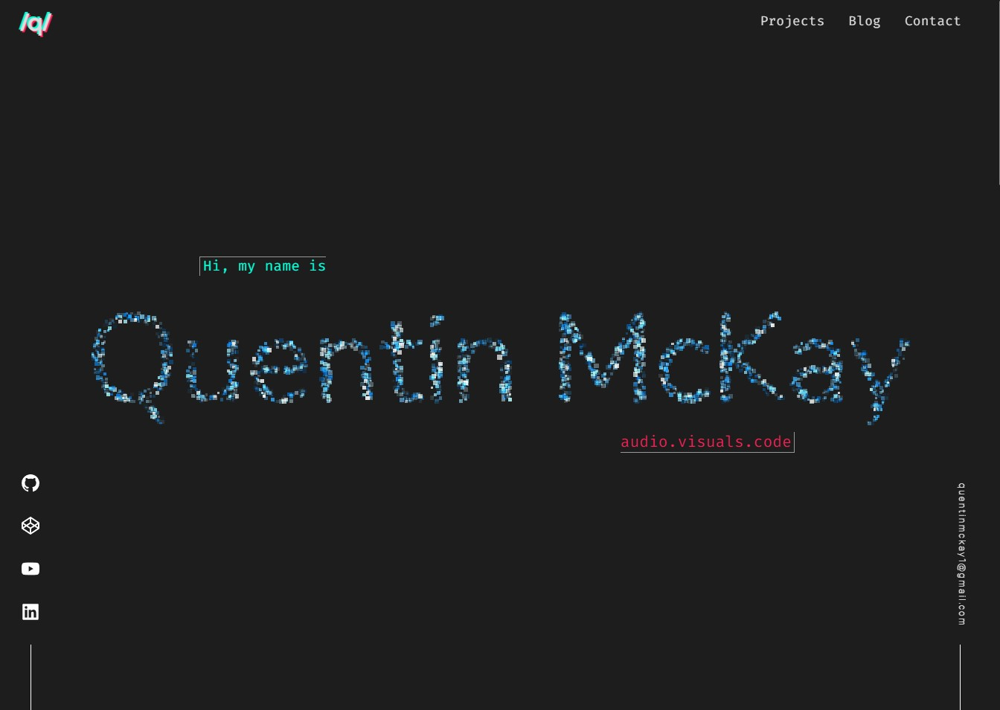
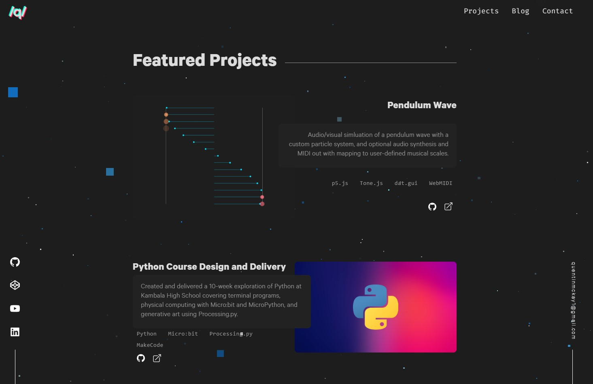
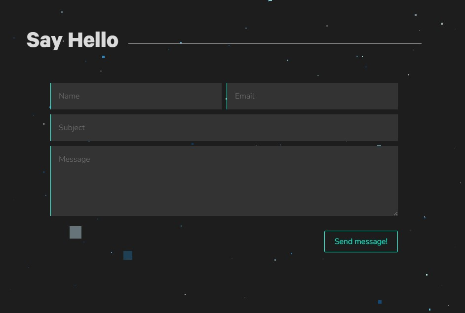
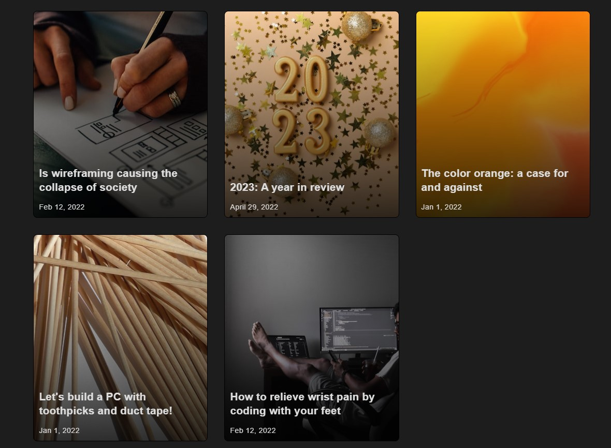
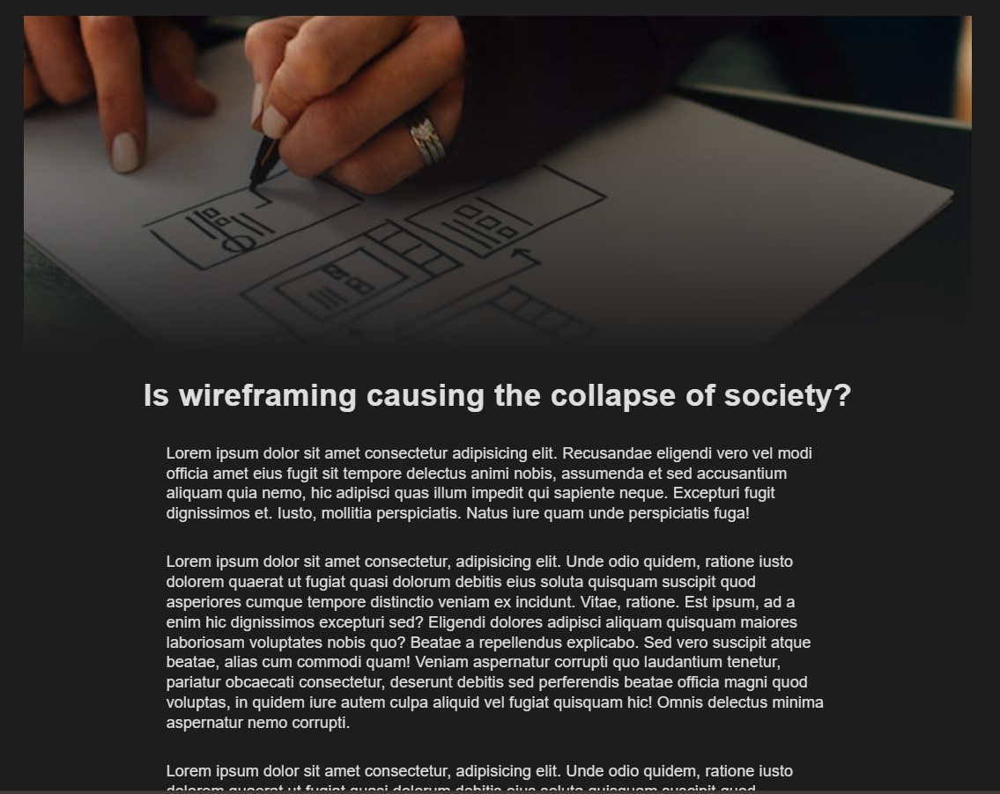
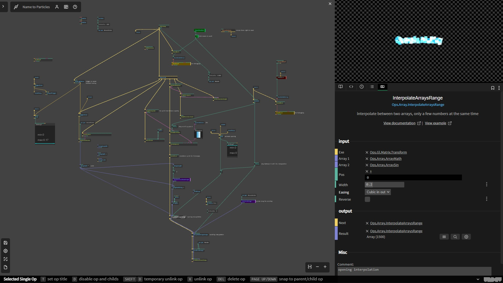

# Quentin McKay Portfolio Website

[Click to view published portfolio website](https://quentin-mckay-portfolio.netlify.app/)

[Click to view GitHub repository](https://github.com/quentin-mckay/portfolio)

## Site Overview

The purpose of this portfolio is threefold. 

First, to show potential collaborators, clients, and employers a bit about who I am, what kind of projects I've worked on in the past, and what am capable of doing in future. 

Second, a chance to refresh old skills, learn new ones, and integrate current interests. Some notable features (to me anyway) are listed below with code examples. 

Third, a reason to clean the digital dust off old projects in order to share the final projects and code online.

I also hoped to display my interest in the intersection of web technology and art by featuring a handmade scroll-controlled point cloud text effect throughout the home page.

Built with HTML/SCSS/JS and [cables.gl](https://cables.gl). Deployed with Netlify.

## Sitemap


The site features a homepage with 3 selected projects and contact form. A nav menu links to a projects archive, a blog with dummy posts, and a link which scrolls down to the contact section.

## Screenshots

### Home page - Hero



### Home page - Featured Projects



### Home page - Contact Form



### Blog page



### Blog single page



## Notable features and new things I learned

### Custom scrollbar

```scss
&::-webkit-scrollbar {
    width: 12px;
}

&::-webkit-scrollbar-track {
    background: $bg-color;
}

&::-webkit-scrollbar-thumb {
    background: #888;
    border: 3px solid $bg-color;
    border-radius: 10px;
}
```

### Animated blur background on mobile menu open

```scss
.blur-layer {
    transition: backdrop-filter 0.8s;
    backdrop-filter: blur(4px) opacity(0);
}

.blur {
    backdrop-filter: blur(4px) opacity(1);
}
```

### SCSS mixins with parameters

```scss
@mixin fade-in-delay($delay) {
    opacity: 0;
    animation: fade-in-homepage 2s forwards;
    animation-delay: $delay;
}
```

### ::after pseudoelement styling for section headings

```scss
&::after {
    content: "";
    display: block;
    height: 1px;
    background: $medium-text-color;
    margin-left: 20px;

    // to make line take up all the remaining space
    flex-grow: 1; 
}
```

### ::before and ::after for Header logo

```scss
&::before {
    content: "/q/";
    position: absolute;
    top: -$color-spread;
    left: -$color-spread;
    color: $green-color;
    z-index: -1;
}

&::after {
    content: "/q/";
    position: absolute;
    bottom: -$color-spread;
    right: -$color-spread;
    color: $red-color;
    z-index: -2;
}
```

### Mobile menu staggered slide in with SCSS for loop
```scss
@for $i from 1 through 4 {
    nav li:nth-child(#{$i}) {
        transition-delay: ($i * 0.1s);
    }
}
```

### Using clamp() for fluid font resizing
```scss
.name {
    visibility: hidden;
    // fluid size scales with window width but stays within 20-80px
    font-size: clamp(20px, 8vw, 80px);
}

### SCSS naming naming techinique and linear-gradient overlay on blog cards
```scss
&-orange {
    background: 
        linear-gradient(rgba(0,0,0,0), $card-gradient-dark-opacity),
        url('../images/orange2.jpg') center;
}
```

### Navbar that hides on scroll down and slides down on scroll up
```js
let prevScrollPos = window.pageYOffset

window.addEventListener('scroll', () => {

    const currentScrollPos = window.pageYOffset
    
    // if scrolling down
    if (currentScrollPos > prevScrollPos) {
        // header.style.top = "-50px"
        // header.style.transform = "translateY(-100%)"
        header.classList.add('hide-header')
        // console.log('down')
    }
    // if scrolling up
    else {
        // header.style.top = "0"
        // header.style.transform = "initial"
        header.classList.remove('hide-header')
        // console.log('up')
    }
    
    prevScrollPos = currentScrollPos
})
```

### Using the IntersectionObserver API to fade elements when they enter the viewport
```js
// add class to all observed elements when they intersect the viewport
const observer = new IntersectionObserver(entries => {
    entries.forEach(entry => {
        if (entry.isIntersecting) {
            // console.log('intersect')
            entry.target.classList.add('fade-in-scroll')
        }
    })
})

// grab all the elements to be observed
// I'm sure there's a better way to do this.
let projects = document.querySelectorAll('.featured-project, .section-heading, .about__content, .contact')
projects.forEach(project => {
    observer.observe(project)
})
```


### Point cloud effect

Used realtime visual patching environment [cables.gl](https://cables.gl/home)

Text texture is randomly sampled to create an array of points.  

Animation on page load drives interpolation between that array and 2nd array of random 3D points (which has a sine function with modulating phase applied). 

`window.pageYOffset` is then used to transform the viewmatrix in Y axis and drive interpolation to a 3rd array of random points (to spread them back out)

Point opacity is controlled by sampling a perlin noise texture (for the sparkle effect).



[Link to the original patch](https://cables.gl/p/55Ipxg). Note: scrolling won't work right now unless it's embedded in a webpage. Right-click to reset initial animation.

#### Issues
1. Scrolling with a trackpad seems to freeze the point cloud animation until released. Not sure why.
2. Performs poorly on less powerful machines. I've implemented a fallback until it can be further optimized. Pressing `t` will toggle the `<canvas>` on/off and replace it with a normal `<h1>` tag.