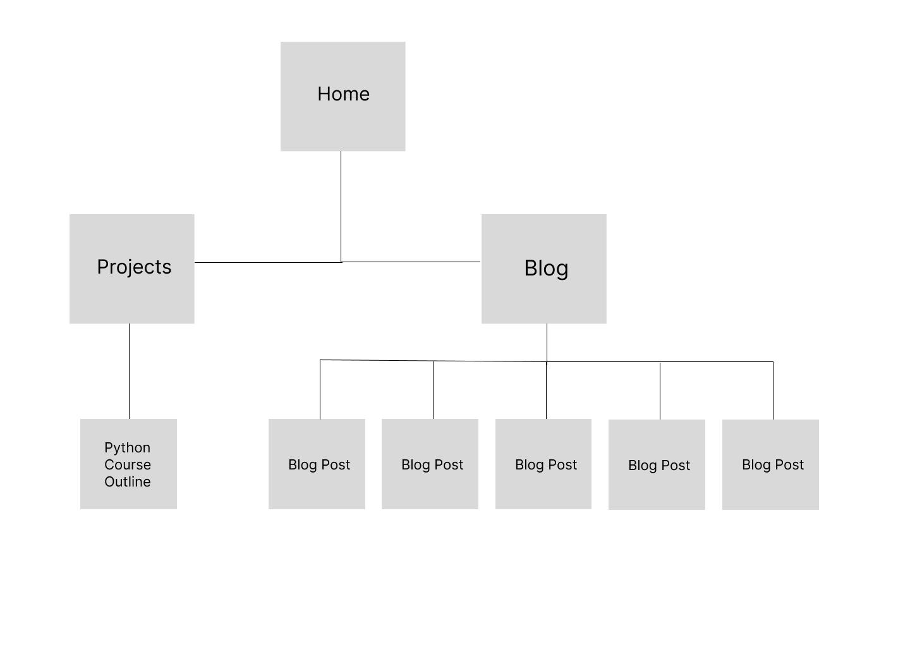

# Quentin McKay Portfolio Website

[Click to view published portfolio website](https://quentin-mckay-portfolio.netlify.app/)

[Click to view GitHub repository](https://github.com/quentin-mckay/portfolio)

## Purpose

The purpose of this portfolio is to show potential collaborators,  clients, and employers a bit about who I am, what kind of projects I've worked on in the past, and what am capable of doing in future.

The site features a homepage with a few projects and contact form. A nav menu provides links to a projects archive, a blog with dummy posts, and a link which scrolls down to the contact section. I hoped to display my interest in the intersection of web technology and art by featuring a handmade scroll-controlled particle text effect throughout the home page.

